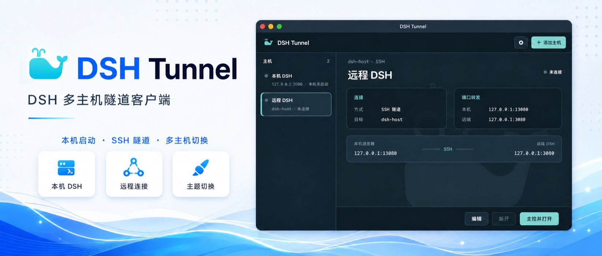
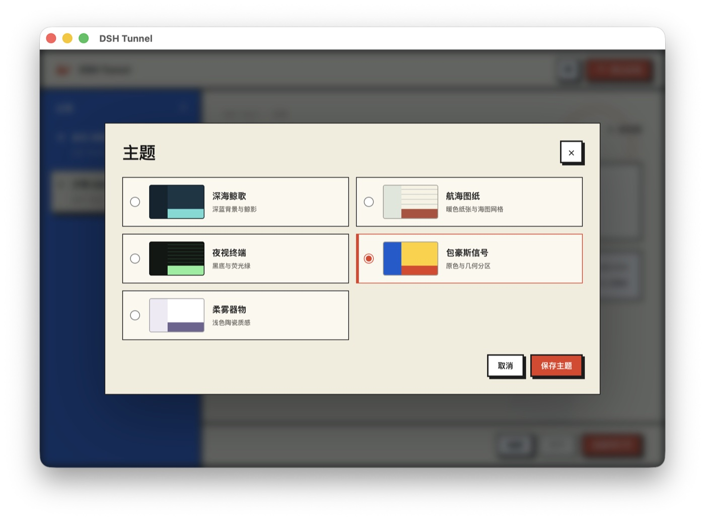
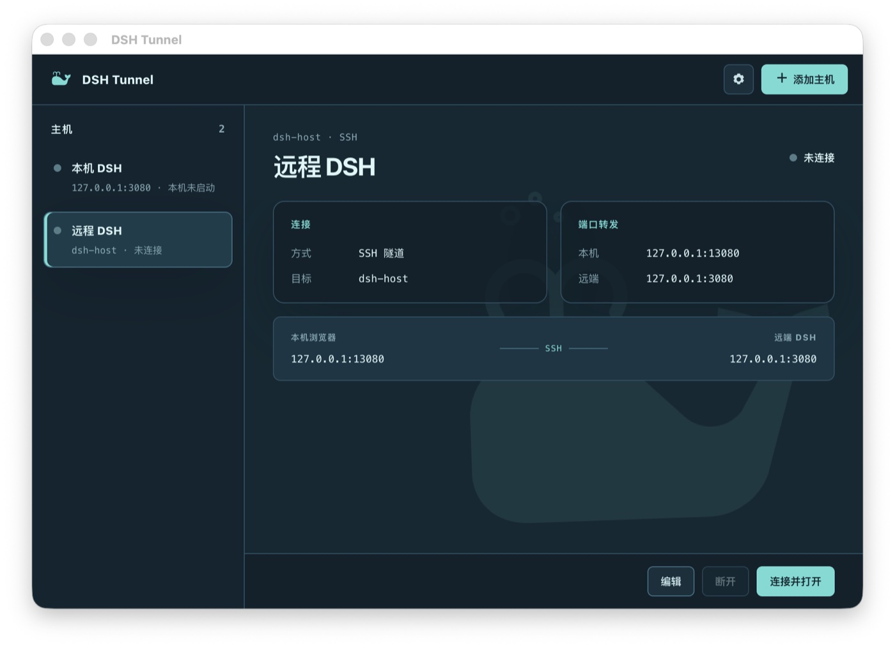
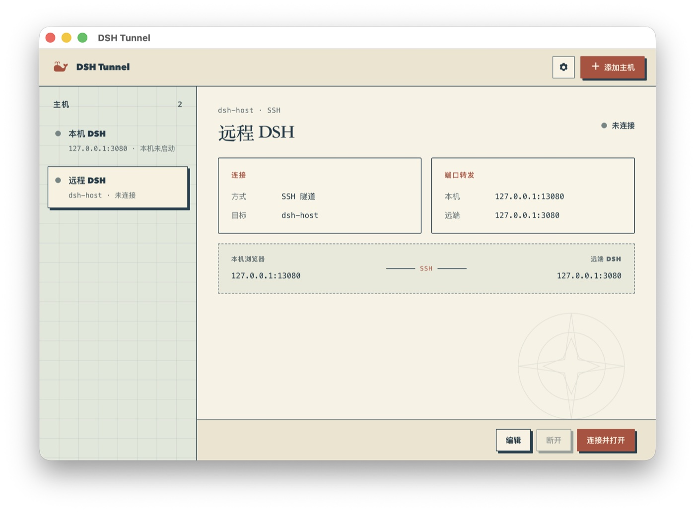
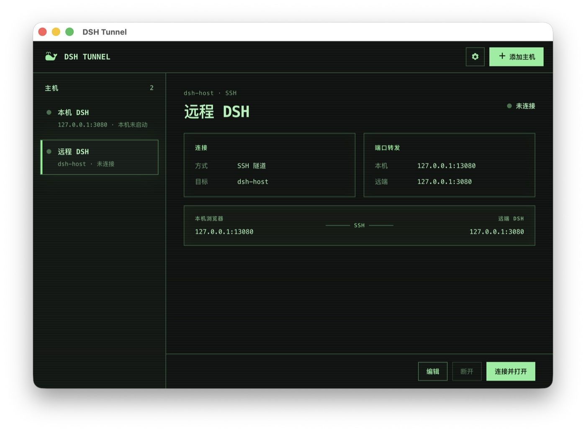
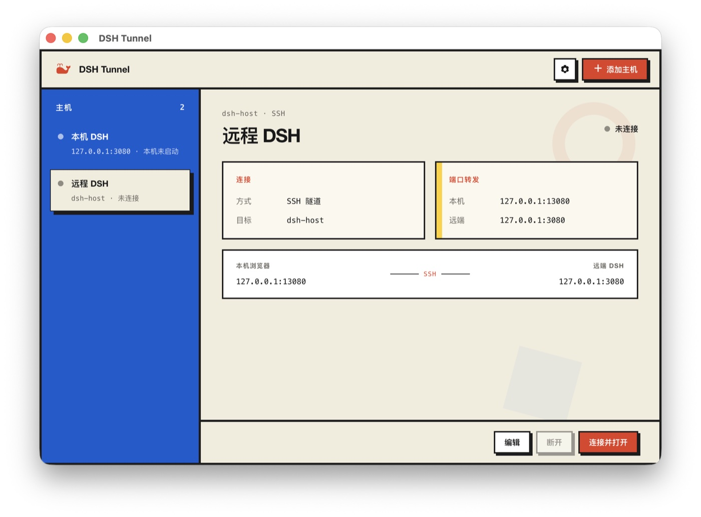
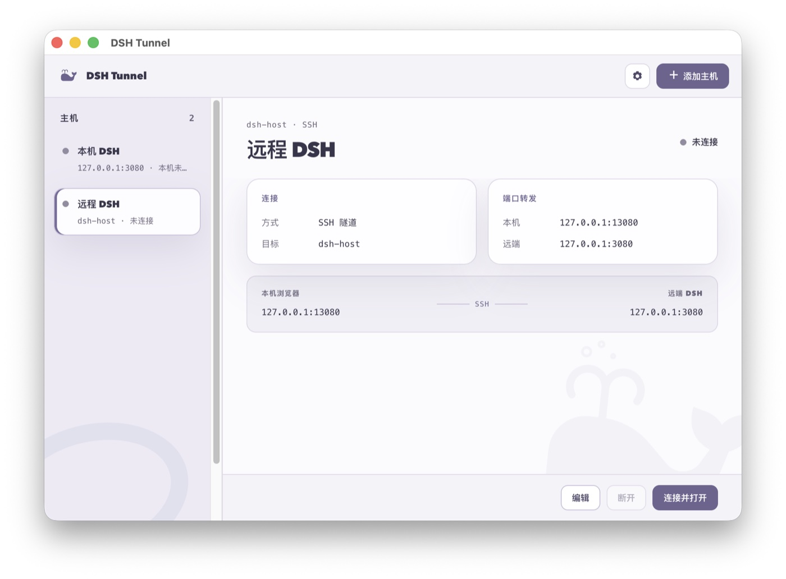

<div align="center">

# DSH Tunnel

[简体中文](README.md) | [English](README.en.md)

       

A desktop utility for launching DeepSeek Harness (DSH) locally and securely connecting to remote DSH instances through the system OpenSSH client.

</div>



## Interface Preview

<table>
  <tr>
    <td align="center"><strong>Theme Selector</strong><br></td>
    <td align="center"><strong>Deep-Sea Whale Song</strong><br></td>
  </tr>
  <tr>
    <td align="center"><strong>Nautical Chart</strong><br></td>
    <td align="center"><strong>Phosphor Terminal</strong><br></td>
  </tr>
  <tr>
    <td align="center"><strong>Bauhaus Signal</strong><br></td>
    <td align="center"><strong>Soft Porcelain</strong><br></td>
  </tr>
</table>

DSH Tunnel can launch a local DSH instance, create local SSH tunnels to remote DSH instances, and open the corresponding WebUI in your default browser.

## Features

- Launch, stop, and open a local DSH instance
- Save and manage multiple remote DSH hosts
- Securely access remote WebUIs through SSH local port forwarding
- Connect to multiple DSH instances at the same time using independent local ports
- Open the default browser automatically when a connection is ready
- Access common actions from the macOS menu bar or Windows system tray
- Choose from five themes: Deep-Sea Whale Song, Nautical Chart, Phosphor Terminal, Bauhaus Signal, and Soft Porcelain
- Use the system SSH configuration, keys, and SSH Agent, with in-app host verification and a dedicated key for first-time pairing

## Supported Platforms

- macOS on Apple Silicon
- Windows x64

## Installation

### macOS

1. Download `DSH.Tunnel-<version>-macos-arm64.dmg`.
2. Open the DMG and drag `DSH Tunnel.app` into Applications.
3. Launch DSH Tunnel from Applications.

The current macOS package uses an ad-hoc signature and is not notarized by Apple. On first launch, macOS may require confirmation under **System Settings → Privacy & Security**.

A matching `.sha256` file is provided for integrity verification:

```bash
shasum -a 256 -c DSH.Tunnel-<version>-macos-arm64.dmg.sha256
```

### Windows

1. Download `DSH-Tunnel-Setup-<version>-x64.exe`, run it, and complete the setup wizard.
2. Alternatively, download `DSH-Tunnel-Portable-<version>-x64.exe` and run it without installation.
3. Launch DSH Tunnel from the Start menu, desktop shortcut, or portable executable.

The current Windows package is not signed with a trusted code-signing certificate, so Windows may display an **Unknown publisher** warning.

## Requirements

- A working OpenSSH client installed on the system
- The `dsh` command installed and available if DSH Tunnel should launch DSH locally
- SSH enabled on remote hosts, with either an existing key or the account password available for first-time pairing
- The remote DSH WebUI reachable from its own host at `127.0.0.1:<port>`

On first connection, DSH Tunnel displays the target device's SSH host-key fingerprint. Verify it through a trusted channel; after confirmation, you can enter the target account's login password once so the client can generate a dedicated key and install its public key. DSH Tunnel does not disable or bypass host-key verification.

## Launching Local DSH

The local DSH entry is always the first item in the host list.

1. Select **Local DSH**.
2. Click **Launch and Open**.
3. DSH Tunnel starts DSH and opens the WebUI when the service is ready.

The default port is `3080`. Use **Edit** to change the display name or launch port; a new port takes effect the next time DSH starts. The client stops only DSH processes that it launched itself and does not terminate externally managed instances.

## Connecting to Remote DSH

Click **Add Host** and enter:

- **Display name**: Used only in the host list
- **SSH address**: An IP address, hostname, or `Host` alias from SSH config
- **SSH user**: Optional; leave blank to use SSH config
- **SSH port**: Optional; leave blank to use SSH config or port `22`
- **DSH port**: The DSH listening port on the remote host; default `3080`
- **Local port**: The port used by the local browser to access this DSH instance

Save the host and click **Connect and Open**. If an existing SSH key already works, the client connects immediately. Otherwise, the first-time pairing dialog asks you to verify the host fingerprint and enter the target account's login password once. Future connections use the dedicated app key without asking for the password again.

For example, if the local port is `13080`, the browser opens:

```text
http://127.0.0.1:13080/
```

Each host must use a different local port. Local DSH and multiple remote DSH connections can run simultaneously as long as their ports do not conflict.

## Menu Bar and System Tray

On macOS, closing the main window keeps DSH Tunnel running in the menu bar. The menu can restore the window, open a WebUI, connect or disconnect remote hosts, and quit the application.

On Windows, the system tray remains available while the window is minimized. Closing the main window exits the application. On exit, DSH Tunnel stops the DSH process and SSH tunnels that it launched. If a process cannot be stopped safely, the client preserves its state and offers a retry.

## Configuration and Privacy

DSH Tunnel stores connection settings such as display names, SSH addresses, SSH users, and ports. A dedicated SSH key generated during first-time pairing is stored in the `ssh/` subdirectory of the platform application-data directory; only its public key is installed on the target device.

DSH Tunnel does not store:

- SSH passwords
- SSH Agent credentials
- DSH account credentials

Configuration files are stored in the platform application-data directory:

- macOS: `~/Library/Application Support/DSH Tunnel/`
- Windows: `%APPDATA%\DSH Tunnel\`

If the host configuration is corrupted, the client backs up the original file before restoring defaults. If it cannot back up or write the file safely, it runs in read-only mode without overwriting the original data.

## Running from Source

Node.js 22 or later is required.

```bash
npm install
npm start
```

Run the tests and syntax checks:

```bash
npm test
npm run check
```

## Building Installers

Build on the corresponding operating system:

```bash
npm run package:mac
npm run package:win
```

macOS outputs:

```text
dist/mac/DSH.Tunnel-<version>-macos-arm64.dmg
dist/mac/DSH.Tunnel-<version>-macos-arm64.dmg.sha256
```

Windows x64 outputs:

```text
dist/DSH-Tunnel-Setup-<version>-x64.exe
dist/DSH-Tunnel-Portable-<version>-x64.exe
```

Public distribution should use Apple Developer ID signing and notarization for macOS, and trusted code signing for Windows.

## License

DSH Tunnel is available under the MIT License.

## Friends

- [LINUX DO](https://linux.do/) — A community of idealists
